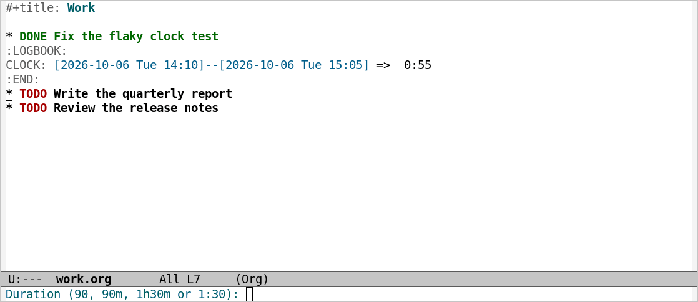
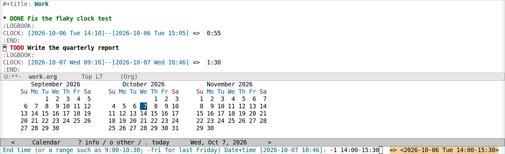

# org-retroclock

[](https://github.com/Jotham-LEC/org-retroclock/actions/workflows/ci.yml)
[](https://github.com/Jotham-LEC/org-retroclock/blob/main/LICENSE)

This package is designed for users who heavily uses org clock reports for timesheets. 

Let's say you just completed a 30min tasks but forgot to log it. 
By default, you had to start a new clock, end it, and modify the entry (or you may hand write the entire entry.)

org-retroclock helps you quickly log your time **retrospectively**, with the current time as the end-time. You say how long the work took, or when it started or ended, and it writes the `CLOCK:` for you, all without starting a clock.



## Installation

org-retroclock requires Emacs 29.1 or later, and the Org that comes with it
(Org 9.6.6 or later). It has no other dependencies.

It is not yet available from MELPA. To install it from its Git repository
with `use-package` (Emacs 30 or later):

```elisp
(use-package org-retroclock
  :vc (:url "https://github.com/Jotham-LEC/org-retroclock" :rev :newest))
```

On Emacs 29, use `package-vc-install` once:

```elisp
(package-vc-install "https://github.com/Jotham-LEC/org-retroclock")
```

With [straight.el](https://github.com/radian-software/straight.el):

```elisp
(straight-use-package
 '(org-retroclock :type git :host github :repo "Jotham-LEC/org-retroclock"))
```

With Doom Emacs, in `packages.el`:

```elisp
(package! org-retroclock
  :recipe (:host github :repo "Jotham-LEC/org-retroclock"))
```

## Commands

<dl>
<dt><code>M-x org-retroclock</code></dt>
<dd>

Log a finished clock entry on the Org entry at point.

</dd>
<dt><code>M-x org-retroclock-recent</code></dt>
<dd>

Choose one of the tasks you clocked recently, and log a finished clock entry
on it. The entry need not be on screen. See [The Recent-Task
List](#the-recent-task-list).

</dd>
</dl>

Both commands read a duration and log a span of that length that ends now.
With a prefix argument (`C-u`), they log a span that starts or ends at a time
you give instead (see [Specifying the Span](#specifying-the-span)).

Each command echoes the line it wrote and the entry it wrote it on, as in
`Logged [2026-10-07 Wed 09:10]--[2026-10-07 Wed 10:40] => 1:30 on Write the
quarterly report`. A task you log on joins `org-clock-history`, so Org's task pickers offer it afterwards.

## Durations

A duration is read in any of these forms:

| You type | Duration           |
| -------- | ------------------ |
| `90`     | 90 minutes         |
| `90m`    | 90 minutes         |
| `1h30m`  | 1 hour, 30 minutes |
| `1:30`   | 1 hour, 30 minutes |
| `1.5h`   | 1 hour, 30 minutes |

Any other duration Org understands is accepted too, and units may be in
either case. The result is rounded to the nearest minute, since a `CLOCK:`
line has no seconds.

NOTE: 
- A trailing `m` means minutes. Default org's own duration syntax reads `m` as months, so that `90m` would be seven and a half years; I assume no one logs a clock in months, so org-retroclock uses minutes instead.

- A duration under one minute is refused, because its line would total `0:00`. A duration over one day is logged only after you confirm it.

## Specifying the Span

With a prefix argument, each command first asks which end of the span to
pin:

```
Anchor: [s]tart time  [e]nd time:
```

Type `s` to give the time the work started, or `e` to give the time it
ended. The command then reads that time with Org's date prompt (see [The
Date/Time Prompt](https://orgmode.org/manual/The-date_002ftime-prompt.html)
in The Org Manual), and then the duration, measured forwards from a start or
backwards from an end. `s` suits "an hour starting at nine this morning";
`e` suits "a meeting that ended at six".



Instead of a single time, you may type a range at the date prompt. The range
is then the whole span, and no duration is asked; it makes no difference
which end you chose to pin. Some examples:

| You type           | Span                                   |
| ------------------ | -------------------------------------- |
| `9:00`             | starts or ends today at 9:00           |
| `-1 14:00`         | starts or ends yesterday at 14:00      |
| `25 14:00`         | starts or ends on the 25th just past   |
| `-fri 17:00`       | starts or ends last Friday at 17:00    |
| `9:00-10:30`       | today, 9:00 to 10:30                   |
| `-1 2pm-3:30pm`    | yesterday, 14:00 to 15:30              |
| `-fri 14:00-15:30` | last Friday, 14:00 to 15:30            |

A date without a year is read as the most recent one, so `25 14:00` means
the 25th that has just gone by. A weekday on its own is not: Org reads `fri`
as the coming Friday whatever it is told, so type `-fri` for the last one.

Org reads both ends of a range on the same day. A range such as
`22:00-01:00` therefore ends before it starts, and is refused; to log a span
that crosses midnight, pin its end and type a duration. Org's own `22:00+3`
form does reach into the next day. Write both ends of a range alike:
`9am-10:30` is refused, because Org reads no start time from it, whereas
`9:00-10:30` and `9am-10:30am` both work.

## What Is Refused

Before writing anything, both commands refuse:

- a buffer that is not in Org mode, a read-only buffer, or a position before
  the first heading. These are checked before any prompt.
- a span under one minute, or one that ends in the future (more than a
  minute from now).
- a range that ends before it starts.
- a span across the autumn clock change whose stamps would come out
  backwards, such as `[02:45]--[02:15]`. Org's timestamps carry no time
  zone, so such a line would total a negative time.

A span over one day is logged only after you confirm it.

## The Recent-Task List

`org-retroclock-recent` offers the same list of tasks as `org-clock-in` does
when called with a prefix argument (`C-u C-c C-x C-i`). The list is built
from `org-clock-history`, which holds a task only while its buffer is open.
If no task in the history has an open buffer, the command says so instead
of offering an empty list.

Org forgets the history when Emacs exits, unless you tell it to keep the
history between sessions:

```elisp
(setq org-clock-persist 'history)
(org-clock-persistence-insinuate)
```

Org then reopens the files of the remembered tasks when it restores the
history. See [Clocking Work
Time](https://orgmode.org/manual/Clocking-Work-Time.html) in The Org Manual.

## Key Bindings

org-retroclock binds no keys, since where they belong depends on where your
other clock commands are. For example, in your init file:

```elisp
(keymap-set org-mode-map "C-c C-x h" #'org-retroclock)
(keymap-global-set "C-c o p" #'org-retroclock-recent)
```

In Doom Emacs, alongside its clock commands:

```elisp
(map! :leader :prefix ("n" . "notes")
      :desc "Retro clock (recent)" "p" #'org-retroclock-recent)
(map! :after org :map org-mode-map :localleader
      :desc "Retro clock (log past)" "c p" #'org-retroclock)
```

## Customization

org-retroclock has no user options of its own. It follows the Org options
that govern clock entries:

<dl>
<dt><code>org-clock-into-drawer</code></dt>
<dd>

Whether the line goes in a drawer, such as `:LOGBOOK:`, and which one. The
drawer is created when needed, as `org-clock-in` creates it.

</dd>
<dt><code>org-clock-rounding-minutes</code></dt>
<dd>

How "now" is rounded when a span ends now, as `org-clock-in` rounds it. A
time you type is used as typed.

</dd>
<dt><code>org-clock-persist</code></dt>
<dd>

Whether the task history, and so the list `org-retroclock-recent` offers,
survives a restart.

</dd>
</dl>

## How It Works

The line goes exactly where a clock-in would have put it.
`org-clock-find-position` chooses the place, creating the drawer if
`org-clock-into-drawer` calls for one. The line is written with
`org-clock-string` and `org-time-stamp-format`, and its total is worked out
from its two stamps, as `org-clock-out` works out its own. `org-clock-sum`,
`org-clock-report` and the agenda's clock views therefore read it like any
other clock entry.

No clock is started, and a running clock is left alone. If the line adds to
the subtree whose clock is running, the total in the mode line is updated.

## Contributing

Bug reports and pull requests are welcome.

```sh
make deps     # package-lint and relint, into ./.deps
make check    # byte-compile, checkdoc, package-lint, relint, format check, ERT
make format   # indent as emacs -Q does
```

CI runs `make check` on Emacs 29.1, 30.1, 31.1 and a development snapshot,
and runs [melpazoid](https://github.com/riscy/melpazoid).
[CONTRIBUTING.md](CONTRIBUTING.md) describes what a change needs. The images
in this file are made by `images/screenshots.el`.

## License

org-retroclock is free software, released under the GNU General Public
License, version 3 or later. See [LICENSE](LICENSE).
